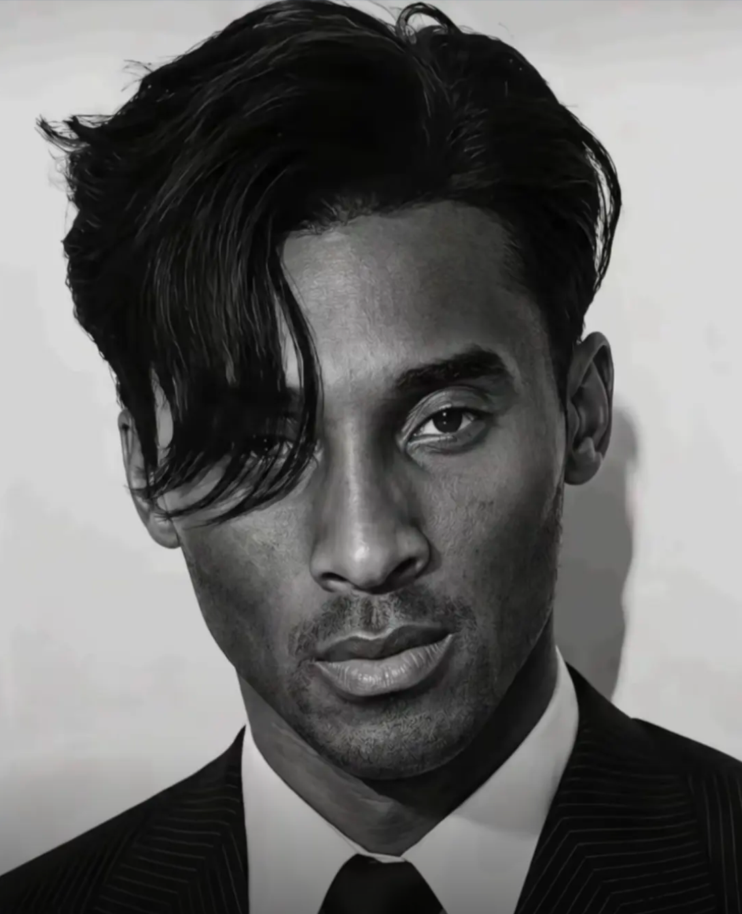
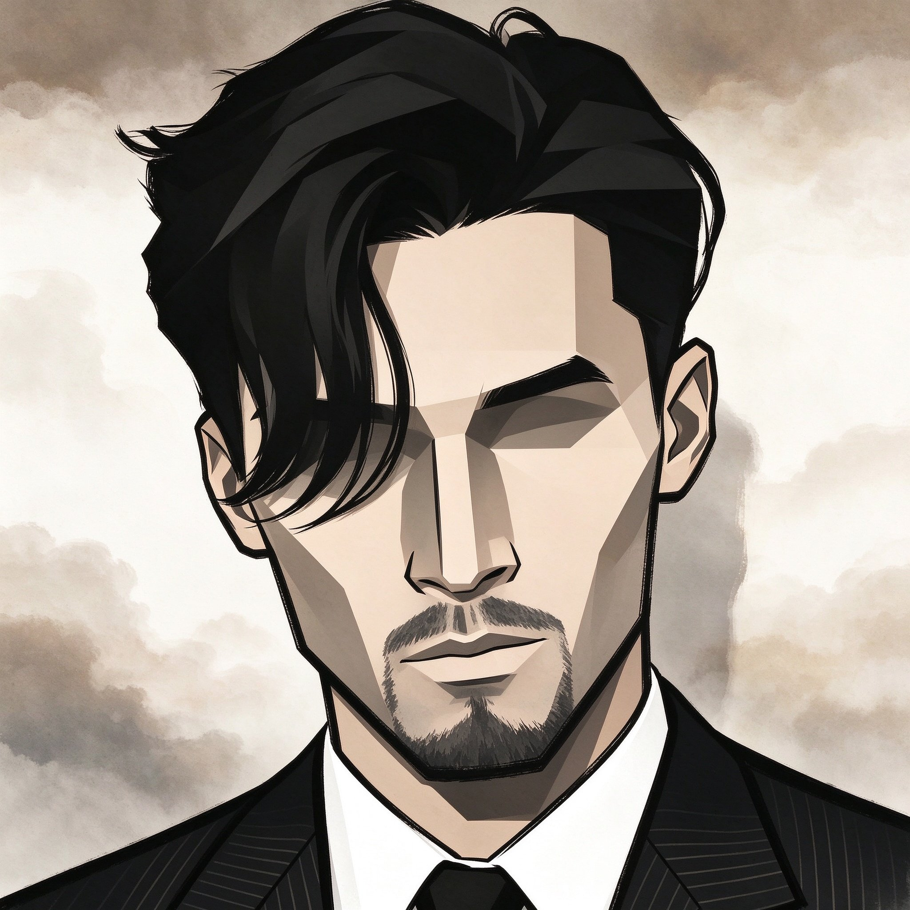

# wuhuistyle-skills

Agent Skills for **flat Chinese-style (guofeng) art conversion**. Currently ships one skill:

| Skill | Directory | What it does |
|---|---|---|
| Wuhui Huaxia Style Converter | [`wu-hui-hua-xia-style/`](wu-hui-hua-xia-style/SKILL.md) | Redraws any **people-containing** image as a flat new-guofeng illustration: hard geometric facets on the figure, bold ink outlines, **no eyes drawn**, and a soft cloud-gradient background |

> 中文说明见 [README.md](README.md)。

## Before / after

| Original | Result |
|---|---|
|  |  |

The figure is rebuilt from large sharp facets — flat fills inside each facet, hard edges with zero blending between them, only 2–3 tonal steps — with bold ink outlines and a completely empty eye region. The background is converted from a photo into soft, layered cloud gradients that keep the atmosphere and depth of the original scene.

## What problem it solves

A generic "make it flat illustration" prompt lets the model improvise, and the usual failures are: the figure comes out soft and painterly, the eyes get drawn with pupils and highlights, the background is left as the untouched photo, or the background turns into hard mosaic blocks. This skill turns those into **checkable hard rules**:

- **Hard figure** — large sharp facets, flat fill, hard edges with zero blending, only 2–3 tonal steps
- **Soft background** — 3–5 layers of soft cloud gradient fading into each other with haze between layers; hard-edged blocks and mosaic are rejected
- **No eyes** — the eye region is left empty: no pupil, sclera, iris, eyelashes, highlights, or eyeliner
- **Simplification** — bead strings become single-colour dots, ornaments are reduced to one or two broad shapes, no fine detail
- **Locked composition** — the number of figures, their poses and positions, and the background layout must match the original

## Install

Each skill follows the Agent Skills convention: a directory with `SKILL.md` plus an optional `references/`.

**📖 Full installation guide — offline/ZIP install, global vs project-local, per-tool commands, uninstall and troubleshooting: [docs/install.md](docs/install.md)** (Chinese)

### No GitHub needed

Three ways to obtain the files — pick one:

```bash
# macOS / Linux: download the ZIP (no git required)
tmp=$(mktemp -d)
curl -L -o "$tmp/w.zip" https://github.com/cloudxys/wu-hui-hua-xia-style/archive/refs/heads/main.zip
unzip -q "$tmp/w.zip" -d "$tmp"
```

```powershell
# Windows
$zip = "$env:TEMP\wuhui.zip"
Invoke-WebRequest "https://github.com/cloudxys/wu-hui-hua-xia-style/archive/refs/heads/main.zip" -OutFile $zip
Expand-Archive $zip -DestinationPath "$env:TEMP\wuhui" -Force
```

Or simply get the `wu-hui-hua-xia-style/` folder from someone and copy it in.

### Global install (available in every project)

| Tool | Global skill directory |
|---|---|
| Shared across tools (Claude Code / Gemini CLI / OpenCode / DSH read it) | `~/.agents/skills/` |
| Claude Code | `~/.claude/skills/` |
| Codex | `~/.codex/skills/` |
| Gemini CLI | `~/.gemini/skills/` |
| OpenCode | `~/.config/opencode/skills/` |
| DSH | `~/.dsh/skills/` |

macOS / Linux:

```bash
SRC="$HOME/Downloads/wu-hui-hua-xia-style"
for r in "$HOME/.agents/skills" "$HOME/.claude/skills" "$HOME/.codex/skills" "$HOME/.gemini/skills" "$HOME/.config/opencode/skills" "$HOME/.dsh/skills"; do
  mkdir -p "$r" && rm -rf "$r/wu-hui-hua-xia-style" && cp -r "$SRC" "$r/wu-hui-hua-xia-style"
done
```

Windows (PowerShell):

```powershell
$src = "$env:TEMP\wuhui\wu-hui-hua-xia-style-main\wu-hui-hua-xia-style"
foreach ($r in @("$env:USERPROFILE\.agents\skills","$env:USERPROFILE\.claude\skills","$env:USERPROFILE\.codex\skills","$env:USERPROFILE\.gemini\skills","$env:USERPROFILE\.config\opencode\skills","$env:USERPROFILE\.dsh\skills")) {
  New-Item -ItemType Directory -Force -Path $r | Out-Null
  $dst = Join-Path $r 'wu-hui-hua-xia-style'
  if (Test-Path $dst) { Remove-Item $dst -Recurse -Force }
  Copy-Item -LiteralPath $src -Destination $dst -Recurse -Force
}
```

Restart the tool afterwards — skills are scanned at session start.

### Project-local install (scoped to one repository, shareable with your team)

Run this from the **project root** (where `.git` lives):

```bash
mkdir -p .agents/skills && cp -r /path/to/wu-hui-hua-xia-style .agents/skills/
```

```powershell
New-Item -ItemType Directory -Force -Path ".agents\skills" | Out-Null
Copy-Item -LiteralPath "C:\path\to\wu-hui-hua-xia-style" -Destination ".agents\skills\wu-hui-hua-xia-style" -Recurse -Force
```

`.agents/skills/` is the cross-tool convention; Claude Code also reads `.claude/skills/`, OpenCode `.opencode/skills/`, Gemini CLI `.gemini/skills/`. Commit it and your teammates get the skill on their next pull.

### Advanced: install once, link everywhere

Keep one source of truth so every root stays in sync (on Windows use a directory junction; no admin rights needed):

```bash
for r in ~/.agents/skills ~/.claude/skills ~/.codex/skills ~/.gemini/skills ~/.config/opencode/skills ~/.dsh/skills; do
  mkdir -p "$r" && rm -rf "$r/wu-hui-hua-xia-style" && ln -s "$PWD/wu-hui-hua-xia-style" "$r/wu-hui-hua-xia-style"
done
```

> Note: a symlink breaks if the source directory is moved or deleted; use plain copies when you want each install to stand alone.

## Usage

Send an image containing people and say "convert this to wuhui huaxia style". The skill will:

1. Read the image and record, item by item, every figure (count / position / pose / clothing / props) and every background element
2. Load the positive and negative prompts from `references/style-prompts.md` and call the image generation capability using the **original image as the image-to-image input**
3. Read the output back and check it against an 11-item self-check list (the first 5 are hard vetoes), regenerating from the original whenever it fails

**Two-reference workflow (strongly recommended):** pass the *original image* together with a *sample whose style you have already approved* into the image tool — image 1 locks the composition, image 2 locks the art style. This is far more reliable than text prompts alone.

## Repository layout

```
wuhui-style-skills/                 (this repo: wu-hui-hua-xia-style)
├── README.md                       中文说明
├── README.en.md                    English documentation (this file)
├── LICENSE
├── docs/                           Installation guide, before/after images and support QR
│   ├── install.md                  Full installation guide (offline, global vs project-local, uninstall)
│   ├── original.png
│   ├── result.jpg
│   └── support.png
└── wu-hui-hua-xia-style/
    ├── SKILL.md                    Skill body: inputs, analysis, workflow, tool calls, error handling, acceptance
    └── references/
        ├── style-prompts.md        Style rules: hard requirements, priority order, positive/negative prompts, fix table, palette, checklist
        └── stability.md            Stability guide: positive substitutes, quantified acceptance, short stable prompt (read when results are inconsistent)
```

## Changelog

- **v1.6.0** The eye rule now seals the **entire eye region** (blocking the pupil alone is not enough — the model draws upper-lid and lash lines to imply an eye); the background is now described as "clean flat fill + uniform one-way gradient, texture count 0", and "soft edge / soft gradient" is documented as a **wording trap** that pushes the model toward watercolour; added a fix for over-bright backgrounds; made explicit that a second repeat failure means switching to image anchors instead of more wording tweaks
- **v1.5.0** Added the stability guide: rule priority (no eyes > hard facets > soft background), a "positive substitute" for the eye area, quantified acceptance, and a short stable prompt; background explicitly excludes watercolour washes and blotches; retries capped at 2
- **v1.4.0** Split "hard figure / soft background" into two independent rules; added the simplification principle (beads, ornaments and folds must not be finely rendered)
- **v1.3.0** Eyes changed to "never draw"; background changed from hard-edged blocks to soft gradients
- **v1.2.0** Added background layering and figure/background hierarchy rules
- **v1.1.0** Added style anchors, colour palette and self-check list; fixed where bold outlines may be used
- **v1.0.0** First release

## Support

If this skill saved you from endless prompt tuning, you're welcome to buy me a coffee ☕

<p align="center">
  
</p>

## Disclaimer

- This is an **unofficial, fan-made prompt-engineering project**. It is **not affiliated with, authorised by, or endorsed by** the game *Wuhui Huaxia* / 《无悔华夏》 or its developer or publisher.
- The repository contains **no official game assets, screenshots, or artwork**; everything here is original prompt text, rules and documentation.
- `docs/original.png` is a third-party portrait photo used for demonstration, and `docs/result.jpg` is a stylised result produced with this skill; both are shown for illustration only and will be removed on request from the rights holder.
- All game names and trademarks belong to their respective owners and are used here only **descriptively**.
- Do not use this skill to produce content that infringes copyright or portrait rights; you are responsible for the compliance of anything you generate.

## License

The prompts and documentation in this repository are released under the [MIT License](LICENSE).
